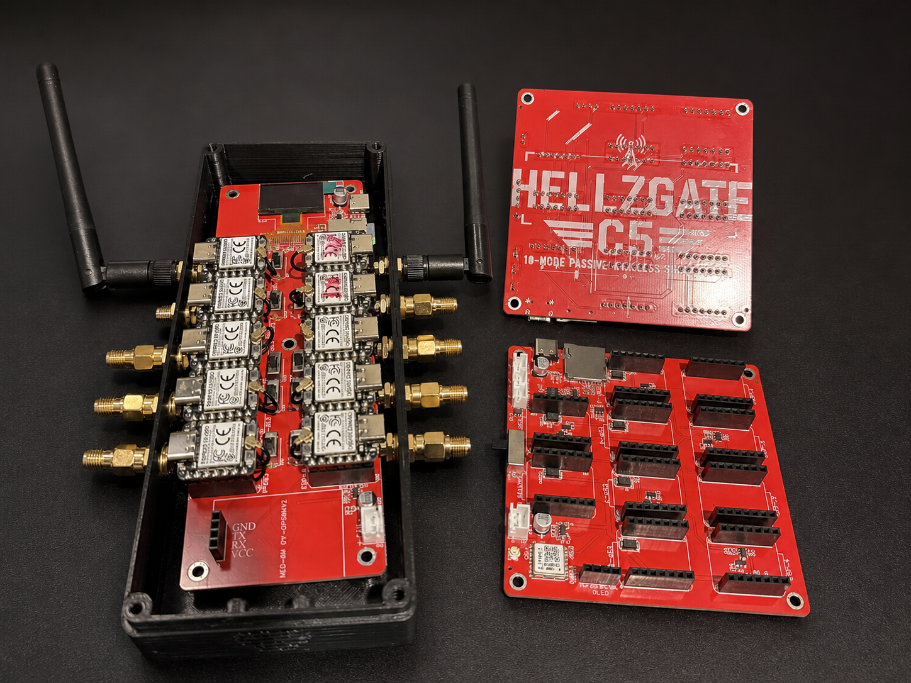

# HellzGate

**An independent, multi-node wireless research platform built around ESP32-C5 hardware.**

HellzGate is the platform. **C5 FullGate** is the first planned public product, with **C5 MiniGate** planned as a later direction.

🌐 **[hellzgate.com](https://hellzgate.com)** · 💬 **[Discord](https://discord.gg/dhMhEgHwXe)**

---

## From working prototypes to FullGate

HellzGate was developed through two working engineering platforms. V1 and V2 were used to prove the multi-node concept and uncover practical lessons in power, communication, integration, firmware, and mechanical design. They are retired field-test prototypes and are not products for sale.

The lessons from those boards informed C5 FullGate, the first planned public HellzGate product.

## C5 FullGate

- Ten removable XIAO ESP32-C5 modules: one master and nine scanner nodes
- Primary I²C production backbone for nine physical scanner slots
- Secondary ESP-NOW wireless communication path
- ESP-NOW scalability work targeting up to 20 scanner nodes per master; validation remains in progress
- Current Phase 1 firmware baseline focused on passive 2.4/5 GHz Wi-Fi and BLE observation
- Onboard GNSS support and local microSD logging
- Qualified USB-C PD input and removable, externally charged 4S battery support
- Battery monitoring and protected system-level power handling
- Optional OLED display and cooling support
- Standalone operation, with companion-app and OTA firmware-management work continuing separately

## Firmware

The embedded firmware is written in **C using Espressif ESP-IDF**, with a **FreeRTOS task-based architecture**.

Phase 1 has run on real ESP32-C5 hardware with a master and multiple scanner nodes exchanging live observation records through ESP-NOW. Hardware testing has been used to identify, correct, and retest timing and queue-management behavior.

The production I²C backbone, ESP-NOW scaling, local services, companion-app integration, and OTA firmware management are separate workstreams with their own validation requirements.

ESP-NOW and OTA are different features: ESP-NOW carries wireless data between nodes, while OTA refers specifically to updating firmware over the air.

The HellzGate firmware is proprietary and is not published in this repository.

## Companion app

The companion-app foundation uses **Flutter and Dart** for Android and iOS. App development and alignment with the firmware remain in progress.

FullGate is being designed to operate as a standalone platform; the app is an additional management and workflow layer rather than a requirement for basic device operation.

## Public technology stack

| Layer | Technology |
|---|---|
| Target hardware | ESP32-C5 · XIAO ESP32-C5 |
| Firmware | C · Espressif ESP-IDF · FreeRTOS |
| Communication | I²C · ESP-NOW |
| Data | Integrity-checked records · WiGLE-compatible CSV |
| App foundation | Flutter · Dart · Android · iOS |
| Website | HTML · CSS · JavaScript |
| Flashing and diagnostics | ESP-IDF · esptool-compatible workflows |

## Current status

| Area | Status |
|---|---|
| V1 field prototype | Retired after development testing |
| V2 field prototype | Retired after development testing |
| FullGate schematic | Complete |
| FullGate PCB layout | Underway |
| Phase 1 firmware | Completed and tested on real ESP32-C5 hardware |
| Nine-slot I²C backbone | Development and hardware validation planned |
| ESP-NOW scaling | Targeting up to 20 scanner nodes per master; validation in progress |
| Companion app | In development |
| MiniGate | Future product direction |

## Responsible use

HellzGate is intended for education, research, and authorized security testing. Use it only with systems, devices, and environments you own or have explicit permission to test. Illegal or unauthorized activity is prohibited.

## Repository boundary

This repository is the public home of the project website and public development history. It does not publish proprietary firmware, schematics, PCB source, Gerbers, manufacturing files, component-level design details, credentials, private logs, or confidential project records.

---

**Designed and developed by Hellz (Sean Clossey).**

© 2026 Sean Clossey / HellzGate. All rights reserved.
