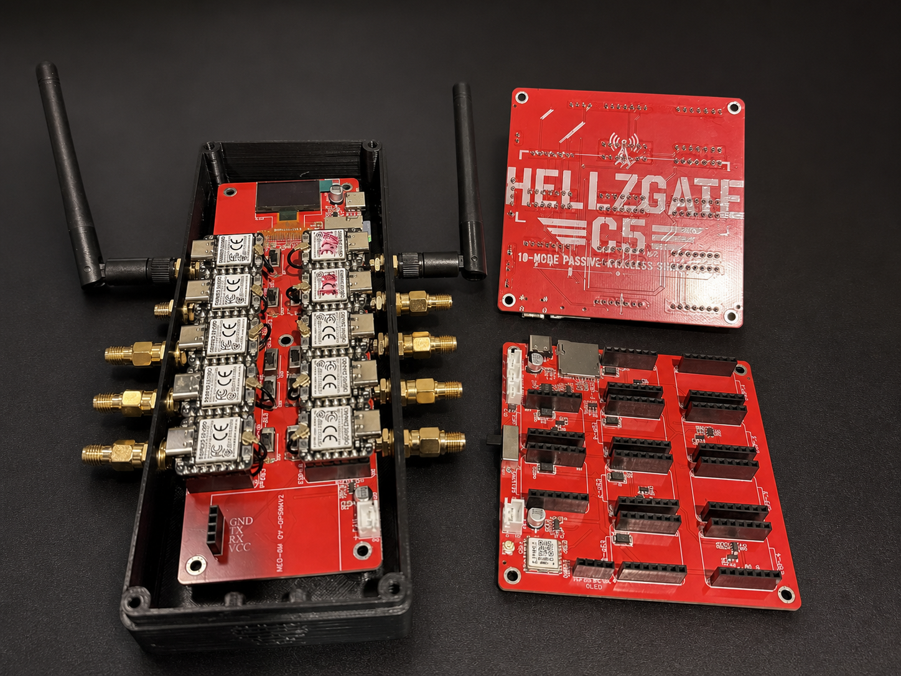
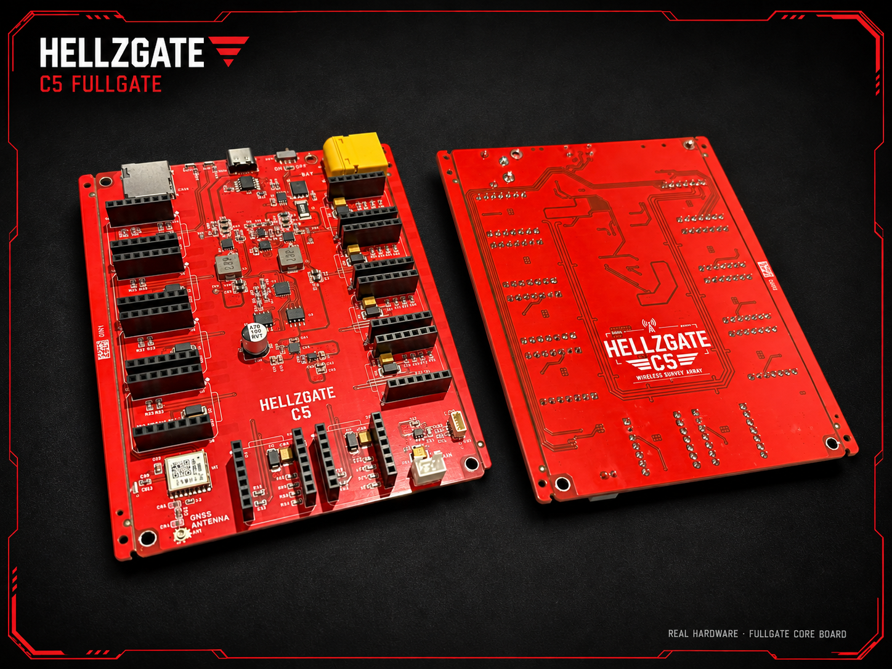

# HellzGate

> **September 13: physical FullGate testing underway.** Separate nine-scanner ESP-NOW and I²C soaks completed, with verified SD files and successful upload tests.

**An independent, multi-node wireless research platform built around ESP32-C5 hardware.**

HellzGate is the platform. **C5 FullGate** is the first planned public product, with **C5 MiniGate** planned as a later direction.

🌐 **[hellzgate.com](https://hellzgate.com)** · 💬 **[Discord](https://discord.gg/dhMhEgHwXe)**

---

## Start here: enable or disable the setup hotspot

**No HellzGate SSID in your Wi-Fi list? The hotspot is off after startup in the currently tested builds.**

1. Let the master finish booting.
2. Hold **M1's BOOT button for about one second, then release** to enable the hotspot.
3. Join Wi-Fi **`hellzgate`**, using default password **`hellzgate`**.
4. Open **`http://192.168.4.1`** in your browser. This is a local network; an internet connection is not expected.
5. To disable the hotspot, repeat the same BOOT hold and release while M1 is running.

Use the master's button, not a scanner's. **Do not press RESET or hold BOOT during power-up for this action**: BOOT at reset is used for flashing. Each hold toggles the state once; repeated holds can turn the hotspot back off. Refresh your Wi-Fi list after toggling and stay connected if your phone reports no internet.

Turning the hotspot off disconnects the dashboard while scanning and SD logging continue. It does not turn off ESP-NOW or make the device radio-silent. A restart returns the hotspot to off in the tested builds. To stop a logging session, use **Stop** on the dashboard; disabling the hotspot is not a stop command.

This behavior applies to the tested FullGate master configurations for both ESP-NOW and wired I²C.

## FullGate nine-scanner validation — September 13, 2026

Separate ten-minute runs used one master and nine scanners. Both maintained a GNSS fix and collected BLE and 2.4/5 GHz Wi-Fi observations.

| Measurement | ESP-NOW | Wired I²C |
|---|---|---|
| Scanners online throughout | 9 | 9 |
| Additional SD rows reported during soak | 22,645 | 20,550 |
| SD write errors | 0 | 0 |
| Transport observations | Zero reported lost frames, overflows or restarts; one duplicate frame discarded | 105,867 additional polls; zero read errors or wrong IDs; initial overflow counts unchanged |
| Retrieved SD file | 47,273 records | 29,102 records |
| Upload test accepted | 47,273 records | 29,039 records after filtering 63 placeholder timestamps |

Both saved files contained metadata and column headers; all rows had 14 columns. File totals include recording outside the timed windows. The ESP-NOW file included startup placeholder dates and zero coordinates; the I²C file had 63 placeholder dates and no zero coordinates. Originals were preserved. Filtering happened in a separate upload copy, not in firmware. Acceptance is confirmed for the tested service only.

Display initialization and startup timestamps remain open issues. Complete charging validation and measured field runtime remain pending. This is bench validation, not a production release or maximum-throughput rating.

## From working prototypes to FullGate

HellzGate was developed through two working engineering platforms. V1 and V2 were used to prove the multi-node concept and uncover practical lessons in power, communication, integration, firmware, and mechanical design. They are retired field-test prototypes and are not products for sale.

The lessons from those boards informed C5 FullGate, the first planned public HellzGate product.

## C5 FullGate

**FullGate · Stylized presentation.** [View the original board photo for actual hardware details](fullgate-development.jpg). [CAD render](fullgate-core-board-cad.jpg).

- Ten removable XIAO ESP32-C5 modules: one master and nine scanner nodes
- Primary I²C production backbone for nine physical scanner slots
- Secondary ESP-NOW wireless communication path
- One master plus 20 scanners demonstrated in an antenna-equipped, ten-minute ESP-NOW bench test; broader load and field validation remain
- Current Phase 1 firmware baseline focused on passive 2.4/5 GHz Wi-Fi and BLE observation
- Onboard GNSS support and local microSD logging
- USB-C PD input and externally charged 4S lithium-ion battery input through XT60
- Power consumption, battery runtime, and complete production-board behavior still to be measured
- Optional OLED display and cooling support
- Standalone transport, GNSS and SD bench tests completed; remaining subsystem validation continues; the production app interface and app integration remain separate work

The planned sale item is the **HellzGate C5 FullGate Core Board**, not a complete ready-to-use system. XIAO modules, antennas, display, fan, power supply, battery, and enclosure are separate. Modules are removable but are not designed for powered hot swapping.

## ESP-NOW scalability checkpoint

The latest adapter-corrected, antenna-equipped test kept **all 20 scanners UP throughout an approximately ten-minute timed window**, with one additional master coordinating them.

- **23,580 additional observation records** across **13,782 frames**.
- **Approximately 39 observation records per second across all 20 scanners combined**, averaged over the timed window—not per scanner, unique devices, or a maximum-throughput rating.
- **No new reported lost frames, overflow, dropouts, or restarts** during the timed window.
- **One new duplicate indication**.
- **Zero bad-CRC, bad-field, or table-full errors**.
- Different antenna types and unequal observation loads were used.

These are timed-window results, not cumulative startup counters or unique-device counts. The result demonstrates this bench setup—not maximum RF capacity, a universal node limit, or complete field validation.

**FullGate remains one master plus nine physical scanner slots.** Tests above nine scanners are ESP-NOW scalability research, not extra slots on a FullGate board.

## Firmware

The embedded firmware is written in **C using Espressif ESP-IDF**, with a **FreeRTOS task-based architecture**.

Phase 1 has run on real ESP32-C5 hardware with a master and multiple scanner nodes exchanging live observation records through ESP-NOW. Hardware testing has been used to identify, correct, and retest timing and queue-management behavior.

FullGate completed separate nine-scanner I²C and ESP-NOW bench soaks with GNSS tagging and microSD logging. Saved files and upload tests were verified. Display initialization and startup timestamps remain open; complete subsystem and field validation continue.

ESP-NOW and OTA are different features: ESP-NOW carries wireless data between nodes, while OTA refers specifically to updating firmware over the air.

The HellzGate firmware is proprietary and is not published in this repository.

## Companion app

The companion-app foundation uses **Flutter and Dart** for Android and iOS. The dashboard, session-storage and export foundation exists; real-device integration remains unfinished. The production API and app integration are still ahead.

FullGate is being designed to operate as a standalone platform; the app is an additional management and workflow layer rather than a requirement for basic device operation.

## Public technology stack

| Layer | Technology |
|---|---|
| Target hardware | ESP32-C5 · XIAO ESP32-C5 |
| Firmware | C · Espressif ESP-IDF · FreeRTOS |
| Communication | I²C · ESP-NOW |
| Data | Integrity-checked records · WiGLE-compatible CSV |
| App foundation | Flutter · Dart · Android · iOS |
| Website | HTML · CSS · JavaScript |
| Prototype and diagnostics | Arduino · ESP-IDF · esptool-compatible workflows |

## Public code examples

The [`examples/`](examples/) directory contains small, standalone Arduino, ESP-IDF/C, and Dart references that demonstrate the project toolchains without exposing production firmware, private protocols, or companion-app internals. Arduino was used during early prototype work; the current production firmware direction uses C with ESP-IDF.

## Current status — September 13, 2026

| Area | Status |
|---|---|
| V1 field prototype | Retired after development testing |
| V2 field prototype | Retired after development testing |
| FullGate schematic | Complete |
| FullGate layout, routing, and manufacturing preparation | Complete; design checks passed and production placement confirmed |
| FullGate validation hardware | Boards on the bench; nine-scanner transport tests complete |
| Phase 1 firmware | Completed and tested on real ESP32-C5 hardware |
| I²C communication | Nine-scanner FullGate soak complete; zero read errors in the ten-minute window |
| ESP-NOW scaling | One master + 20 scanners demonstrated in a ten-minute bench window; not maximum-load validation |
| Standalone Base firmware | GNSS, SD files and both transport soaks verified; remaining subsystem and field checks pending |
| Companion app | Foundation exists; device integration and release preparation pending |
| MiniGate | Future product direction |

## Start-to-finish roadmap

- [x] Build and field-test the V1 and V2 engineering prototypes; retire both as development hardware.
- [x] Complete FullGate design, routing, design checks, and manufacturing preparation.
- [x] Confirm production placement and order five validation boards.
- [x] Test the Wi-Fi/BLE firmware foundation, record integrity, counting, and deduplication on real hardware.
- [x] Bench-test native I²C with live observation records.
- [x] Demonstrate one master plus 20 reporting ESP-NOW scanners in the documented bench window.
- [ ] Verify the complete standalone firmware: GNSS, microSD sessions, WiGLE 1.6 CSV, web status, JSON, OLED, and fan.
- [x] Bring up the physical FullGate test array with one master and nine scanners.
- [ ] Extend full-array testing with longer sessions and repeatable setup checks.
- [x] Complete separate nine-scanner ESP-NOW and I²C ten-minute soaks, retrieve SD files and test uploads.
- [ ] Complete battery charging validation and measure consumption and field runtime.
- [ ] Complete sustained-load and field tests, extending the completed bench saved-file and upload checks.
- [ ] Build and test the enclosure for fit, access, cooling, and field use.
- [ ] Finalize the production app interface and complete device integration against the verified baseline.
- [ ] Complete documentation, repeatable board checks, beta testing, and applicable compliance work before release.

Successful bench tests do not replace production-board or field validation. Release timing will follow verified readiness.

## Future exploration

- **Multigating:** independently powered FullGates managing their own scanners and forwarding aggregated data wirelessly to a central collector. Exploratory, not implemented.
- **MiniGate:** a smaller platform after FullGate is established; specifications and timing are not finalized.

## Responsible use

HellzGate is intended for education, research, and authorized security testing. Use it only with systems, devices, and environments you own or have explicit permission to test. Illegal or unauthorized activity is prohibited.

## Repository boundary

This repository is the public home of the project website and public development history. It does not publish proprietary firmware, schematics, PCB source, Gerbers, manufacturing files, component-level design details, credentials, private logs, or confidential project records.

---

**A project by Hellz.**

© 2026 HellzGate. All rights reserved.
